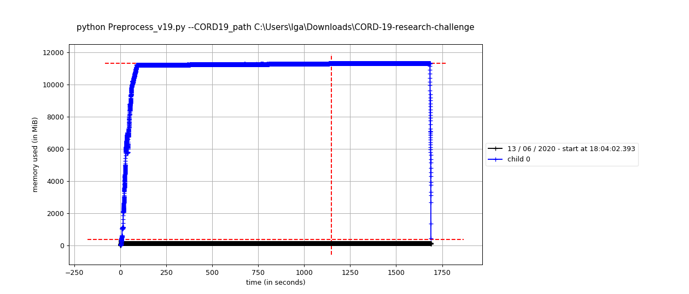

# Preprocessing CORD19 v19

To facilitate the annotation process for the 
CORD19 collection of scientific papers we are building a pipeline consisting of:

* [Spacy](https://spacy.io/) library
* [SciSpacy](https://allenai.github.io/scispacy/) library and models:
  * en\_core\_sci\_lg
  * en\_ner\_craft\_md
  * en\_ner\_jnlpba\_md
  * en\_ner\_bc5cdr\_md
  * en\_ner\_bionlp13cg\_md
* [Pathos](https://pypi.org/project/pathos/) multiprocessing
* [Langdetect](https://github.com/Mimino666/langdetect) for language detection
* [Googletrans](https://github.com/ssut/py-googletrans) for translation of non-English publications
* [tqdm](https://github.com/tqdm/tqdm) library for progress bars
* [Memory Profiler](https://github.com/pythonprofilers/memory_profiler) for development purposes
* [Pandas](https://pandas.pydata.org/) for Cord19 metadata file processing
* cuasal Python3.7 built-in libraries (random, os, utils etc...)

SciSpacy may malfunction in one way or another because of dependency differences. 
Please, pay attention to requirements file.

## Usage

In your command line:

`python preprocess_v19.py --CORD19_path <cord19path> --delta <yourdeltajsonfile>`
  
If you want to monitor RAM usage with Memory Profiler:

`mprof run --multiprocess python preprocess_v19.py --CORD19_path <cord19path> --delta <yourdeltajsonfile>`

After the execution you can plot data from Memory Profiler by:
`mprof plot`

If you execute the CORD19 pipeline on a server, you can just download the log file of Memory Profiler and run it locally. More [here](https://pypi.org/project/memory-profiler/). 
